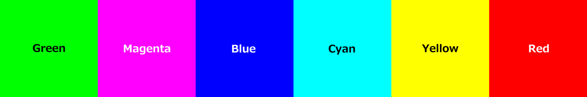

# ComfyUI-SBTools

**Latest Version: 1.4.1**

Custom node collection for ComfyUI. Background removal, color analysis, and dynamic prompt generation tools.

## Nodes

| Node                            | Category       | Description                                                              |
| ------------------------------- | -------------- | ------------------------------------------------------------------------ |
| BiRefNet RemoveBG (SBTools)     | SBTools/Image  | Advanced background removal with 5 model variants                        |
| Alpha to Chroma Key (SBTools)   | SBTools/Image  | Find safe chroma key colors and fill transparent areas automatically     |
| Variable Prompt (SBTools)       | SBTools/Prompt | Define variables with sequential/random/conditional selection modes      |
| Variable Image Loader (SBTools) | SBTools/Image  | Load images from folder with pattern matching and flexible control       |
| Variable Combiner (SBTools)     | SBTools/Prompt | Combine multiple variable lists for unlimited expansion                  |
| Variable Builder (SBTools)      | SBTools/Prompt | Generate prompts and load images with debug info and combination details |

## Installation

### Method 1: ComfyUI Manager (Coming Soon)

ComfyUI Manager support is in preparation. For now, please use manual installation.

### Method 2: Manual Installation

**Step 1: Open your ComfyUI custom nodes folder**

- Windows Portable: `ComfyUI_windows_portable\ComfyUI\custom_nodes`
- Standard: `ComfyUI\custom_nodes`

**Step 2: Open terminal in this folder and clone the repository**

```bash
git clone https://github.com/Amatsukast/ComfyUI-SBTools.git
```

**Step 3: Install dependencies**

**For Windows Portable:**

```bash
cd ComfyUI-SBTools
..\..\..\python_embeded\python.exe -m pip install -r requirements.txt
```

**For Standard Installation (venv/conda):**

```bash
cd ComfyUI-SBTools
pip install -r requirements.txt
```

**Step 4: Restart ComfyUI**

**To update:** Navigate to the `ComfyUI-SBTools` folder and run `git pull`, then update dependencies with `pip install -r requirements.txt` and restart ComfyUI.

## Usage

### Prompt Generation Nodes

Located under `SBTools/Prompt` category. These nodes create a flexible prompt generation system optimized for FLUX.2 and other modern image generation models.

#### Example Workflow 1: Basic Variable Prompt


This example demonstrates the complete prompt generation workflow:

**Variables defined:**

- `GENDER`: man, woman (Sequential)
- `AGE`: young, middle-aged, old (Sequential)
- `CLOTHING`: suit, lab coat, casual wear (Sequential)
- `ACCESSORY`: glasses, hat, [NONE] (Random with prefix " and ")

**Setup:**

- 4 variables combined with Variable Combiner
- Template: `"A [AGE] [GENDER] in [CLOTHING][ACCESSORY]."`
- Primitive node with `increment` controls the index for batch processing

**Result:**

- **18 sequential combinations** (2 × 3 × 3 from Sequential variables)
- **Random accessory** selected each execution (3 choices including [NONE])
- Example output: `"A young man in suit and glasses."`

**Download:** [Variable Prompt.json](examples/Variable%20Prompt.json)

---

#### Example Workflow 2: Variable Prompt with Images


This example demonstrates the combined text + image workflow:

**Variables defined:**

- `GENDER`: man, woman (Sequential)
- `AGE`: young, middle-aged, old (Sequential)
- `CLOTHING`: suit, lab coat, casual wear (Random)
- `ACCESSORY`: glasses, hat, [NONE] (Random with prefix " and ")
- **Image Variable**: body reference images from folder (Sequential)

**Setup:**

- 4 text variables + 1 image variable combined with Variable Combiner
- Variable Builder generates prompts and loads images
- Primitive node with `increment` controls the index for batch processing

**Result:**

- Full combinations of text variables × image files
- Example: 2 (gender) × 3 (age) × 3 (body images) = 18 combinations
- Clothing and accessory are randomized for each execution
- Each index outputs corresponding prompt + image

**Download:** [Variable Prompt and Image.json](examples/Variable%20Prompt%20and%20Image.json)

---

#### Example Workflow 3: Conditional Variables (Basic)


This example demonstrates the conditional variable system:

**Variables defined:**

- `GENDER`: man, woman (Sequential)
- `AGE`: young, middle-aged, old (Sequential)
- `CLOTHING`: suit, casual (Sequential, with conditional values)
  - Common: suit, casual
  - `[man]`: business suit
  - `[woman]`: dress, skirt
  - `[*]`: sportswear (back to common)
- `ACCESSORY`: glasses, watch, [NONE] (Random)

**Setup:**

- Variables connected sequentially: GENDER → AGE → CLOTHING → ACCESSORY
- Each variable's `var_list` output connects to the next variable's `var_list` input
- Variable Builder generates prompts based on conditional logic

**Result:**

- Clothing options change based on GENDER value
- For "man": suit, casual, business suit, sportswear
- For "woman": suit, casual, dress, skirt, sportswear
- Total combinations automatically calculated

**Download:** [Variable Prompt Conditional_1.json](examples/Variable%20Prompt%20Conditional_1.json)

---

#### Example Workflow 4: Conditional Variables (Advanced)


This example demonstrates complex conditional logic with multiple conditions:

**Variables defined:**

- `GENDER`: man, woman (Sequential)
- `AGE`: young, old (Sequential)
- `CLOTHING`: Multiple conditional sections
  - Common values
  - `[man]`: men's clothing
  - `[woman]`: women's clothing
  - `[young&&man]`: young men's casual wear
  - `[old||woman]`: elegant clothing for old people OR women
  - `[*]`: universal clothing items
- `ACCESSORY`: Context-aware accessories with ConditionalRandom mode

**Setup:**

- Complex condition syntax: `&&` (AND), `||` (OR), `[*]` (wildcard)
- ConditionalRandom mode: Random selection within available conditional values
- Variable Builder shows all combinations with debug output

**Result:**

- Clothing dynamically filters based on GENDER and AGE
- Example: young man → includes young men's casual wear
- Example: woman (any age) → includes elegant clothing (OR condition matches)
- Accessory randomly selected from context-appropriate options

**Download:** [Variable Prompt Conditional_2.json](examples/Variable%20Prompt%20Conditional_2.json)

---

#### Example Workflow 5: Image Load from Folder


This example demonstrates the Variable Image Loader used as a standalone image loader:

**Features:**

- Load images from folder with glob pattern matching
- Sequential and Random modes with index/seed control
- Natural sort order (file1, file2, ..., file10)
- Subfolder search with recursive option
- RGBA preservation or background fill with custom color
- Filename output with optional extension toggle

**Setup:**

- Variable Image Loader with folder path and pattern (e.g., `*.png`)
- `image` output connects directly to image processing nodes
- Primitive node with `increment` controls the index for sequential loading
- `total_images` and `filename` outputs for debugging

**Result:**

- Simple image batch processing without text variables
- Perfect for testing, preprocessing, or sequential image loading
- Can also be used with Variable Combiner for combined workflows

**Download:** [Image Load from Folder.json](examples/Image%20Load%20from%20Folder.json)

---

#### System Overview

The prompt and image generation system consists of these nodes:

1. **Variable Prompt** - Define text variables with their values
2. **Variable Image Loader** - Load images from folder with flexible control
3. **Variable Combiner** - Combine multiple variables into lists (optional, for complex workflows)
4. **Variable Builder** - Generate prompts and load images with debug info

#### Quick Start

**Simple Example (2-3 variables):**

```
Variable 1 (GENDER: man, woman) → Compiler
Variable 2 (AGE: young, old)    ↗
```

**Complex Example (7+ variables):**

```
Variables 1-3 → Combiner A ┐
Variables 4-6 → Combiner B ├→ Compiler
Variable 7    ──────────────┘
```

---

### Variable Prompt

Define a single variable with multiple values. Variables can operate in four modes: Sequential, Random, Conditional, and ConditionalRandom.

#### Parameters

**Required:**

- `tag_name` - Variable name for template replacement (e.g., `GENDER`, `CLOTHING`)
  - **Leave empty** for auto-naming (`_VAR_xxxxxx`) - useful when not using template replacement
  - Auto-named variables are exempt from duplicate checking
- `values` - List of values, one per line
  - Use empty line or `[NONE]` for "no value" option
  - Use `[condition]` syntax for conditional values (see Conditional Variables below)
- `randomize` - Toggle between modes:
  - **OFF (Sequential/Conditional)**: Cycle through all values systematically
  - **ON (Random/ConditionalRandom)**: Pick one value randomly each execution

**Optional:**

- `prefix` - Text added before the value (only in template mode)
- `suffix` - Text added after the value (only in template mode)
- `var_list` - Connect previous variable to enable conditional logic based on its values

#### Important Notes

**Tag Name Conflicts:**

- Using the same tag name with different values in Variable Combiner will cause an error
- To avoid conflicts, either use unique names or leave tag_name empty for auto-naming
- Auto-named variables (`_VAR_*`) can be duplicated without conflicts

**Conditional Variable Warnings:**

- If a condition doesn't match any previous variable values, a warning will be displayed
- Values following unmatched conditions will be ignored
- Check for typos in condition syntax if you see warnings

#### Output

- `var_list` - Variable data (connect to Combiner or Compiler)

#### Examples

**Basic variable:**

```
tag_name: "GENDER"
values: "man\nwoman"
randomize: OFF
```

**With prefix/suffix:**

```
tag_name: "ACCESSORY"
values: "glasses\nhat\n[NONE]"
prefix: " wearing "
randomize: ON
```

#### Conditional Variables

Variables can change their available values based on previous variable values. Connect the `var_list` output from a previous variable to enable conditional logic.

**Syntax:**

```
common_value1
common_value2
[condition]
conditional_value1
conditional_value2
[*]
back_to_common
```

**Condition Formats:**

- `[man&&suit]` - AND condition: man AND suit
  - Syntaxes: `&&`, `AND` (uppercase only), `＆＆` (full-width)
- `[suit||casual]` - OR condition: suit OR casual
  - Syntaxes: `||`, `OR` (uppercase only), `｜｜` (full-width)
- `[*&&suit]` - Wildcard AND: any value AND suit (gender doesn't matter)
- `[GENDER:man&&CLOTHING:suit]` - Tag name specification for duplicate values
  - `:` for tag specification (also supports full-width `：`)
- `[*]` - Return to common values (end conditional section)

**Example Workflow:**

```
Variable 1 (GENDER):
  man
  woman

Variable 2 (CLOTHING) - var_list connected to Variable 1:
  suit
  casual
  [woman]
  dress
  [*]
  sportswear
```

**Result:**

- If GENDER = "man": Available = suit, casual, sportswear
- If GENDER = "woman": Available = suit, casual, dress, sportswear

**With Random Mode:**

Set `randomize: ON` on the conditional variable to enable ConditionalRandom mode. The system will:

1. Determine available values based on current conditions
2. Randomly select one from the available set

**Complex Conditions:**

```
Variable 1 (GENDER): man, woman
Variable 2 (AGE): young, old
Variable 3 (CLOTHING):
  suit
  casual
  [man&&young]
  hoodie
  [woman||old]
  elegant dress
  [*]
  sportswear
```

**Result:**

- man + young: suit, casual, hoodie, sportswear
- man + old: suit, casual, elegant dress, sportswear (old matches OR condition)
- woman + young: suit, casual, elegant dress, sportswear (woman matches OR condition)
- woman + old: suit, casual, elegant dress, sportswear (both match OR condition)

---

### Variable Combiner

Combine multiple variable lists into one. Useful for organizing complex prompts with many variables.

#### Parameters

**Optional:**

- `var_list1` to `var_list6` - Variable lists from Variable nodes or other Combiners

#### Output

- `var_list` - Combined variable list

#### Usage

**Organize by category:**

```
Character variables (3) → Combiner A ┐
Clothing variables (3)  → Combiner B ├→ Combiner C → Compiler
Scene variables (2)     → Combiner C ┘
```

**Chain for unlimited expansion:**

- Each Combiner supports 6 inputs
- Connect Combiner outputs to other Combiners
- No limit on total number of variables

#### Duplicate Detection

Variable Combiner automatically checks for duplicate variables:

**Exact duplicates** (same name, values, and mode):

- Automatically skipped with info message
- Second occurrence is ignored
- Example: Same GENDER variable used in multiple branches

**Conflicting duplicates** (same name, different values):

- Throws error and stops execution
- Must be fixed by renaming or using empty tag names
- Example: Two different definitions of GENDER

**Auto-named variables** (`_VAR_*`):

- Always exempt from duplicate checking
- Can appear multiple times without conflict

---

### Variable Image Loader

Load images from a folder with flexible control. Can be used standalone or combined with text variables for full workflow generation.

#### Parameters

**Required:**

- `folder_path` - Path to folder containing images (absolute or relative)
- `pattern` - File pattern for glob matching (e.g., `*.png`, `body_*.jpg`)
- `index` - Index to select which image in sequential mode (loops automatically)
- `randomize` - Toggle between modes:
  - **OFF (Sequential)**: Cycle through images by index
  - **ON (Random)**: Pick one image randomly based on seed
- `seed` - Seed for random selection

**Optional:**

- `include_subfolders` - Search in subfolders (requires `**/` in pattern, default: OFF)
- `include_extension` - Include file extension in filename output (default: OFF)
- `fill_background` - Fill transparent areas with solid color (default: OFF, keeps RGBA)
- `background_color` - Background color in hex format (e.g., `#FFFFFF` for white)

#### Outputs

- `image` - Loaded image (IMAGE type, for standalone use)
- `var_list` - Variable list (for Variable Combiner)
- `total_images` - Total number of images found
- `filename` - Current filename (with or without extension)

#### Features

- **Natural sort order**: Files are sorted like Windows Explorer (e.g., file1, file2, ..., file10)
- **RGBA preservation**: Transparent images keep transparency by default
- **Multibyte support**: Japanese and other multibyte characters in paths/filenames work correctly
- **Dual output**: Use as standalone image loader OR as variable for combination workflows

#### Examples

**Standalone image loader:**

```
Variable Image Loader (folder: body_refs/, pattern: *.png)
  ├─ image → FLUX2
  └─ index ← Primitive (increment)
```

**Combined with text variables:**

```
Variable Prompt (GENDER) ┐
Variable Prompt (AGE)    ├→ Variable Combiner → Variable Builder
Variable Image Loader    ┘                            ↓
                                              prompt + image
```

---

### Variable Builder

Generate prompts and load images with full debug information. Supports text-only workflows, image workflows, or combined workflows.

#### Parameters

**Required:**

- `template` - Template text with `[TAG_NAME]` placeholders
  - Leave empty for simple join mode
  - Example: `"A [AGE] [GENDER] wearing [CLOTHING]."`
- `index` - Index to select which Sequential combination (loops automatically)
- `seed` - Seed for Random **TEXT** variables (Image Variables have independent seeds)
- `separator` - Character(s) to join values (default: `", "`)

**Optional:**

- `var_list` - Variable list from Variable Prompt, Variable Image Loader, or Variable Combiner

#### Outputs

- `prompt` - Generated prompt text (STRING)
- `image1-4` - Loaded images (IMAGE × 4, empty if no image variables)
- `max_combinations` - Total number of sequential combinations (INT)
- `all_combinations` - Debug text listing all patterns with index numbers (STRING)

#### Modes

**Template Mode** (template not empty):

- Tags like `[TAG_NAME]` are replaced with values
- Unused variables are appended at the end

**Simple Join Mode** (template empty):

- All values are joined with separator

#### Features

- **Text-only or image workflows**: Works with any combination of text and image variables
- **Up to 4 images**: Perfect for FLUX.2 Reference workflow with multiple reference images
- **Independent seed control**: Each Image Variable uses its own seed, text variables use Variable Builder's seed
- **Full combination calculation**: All Sequential text × Sequential images × Random variations
- **Debug output**: `max_combinations` shows total patterns, `all_combinations` lists all with index
- **Random preview**: Shows `[RANDOM: choice1|choice2|...]` for random variables in debug output
- **Empty slot handling**: Unused image slots automatically filled with blank images

#### Example Workflow

**For FLUX.2 Reference with multiple images:**

```
Variable Prompt (STYLE) ┐
Variable Prompt (POSE)  ├→ Variable Combiner
Variable Image (Body)   ┤       ↓
Variable Image (Face)   ┘  Variable Builder
                                ↓
                    prompt + image1 + image2
                                ↓
                           FLUX2 with
                        Reference Latent
```

**Combination calculation:**

```
STYLE: 3 values (Sequential)
POSE: 4 values (Sequential)
Body images: 5 files (Sequential)
Face images: 3 files (Sequential)

Total: 3 × 4 × 5 × 3 = 180 combinations
```

#### Tips

**Batch processing:**

- Connect Primitive (INT, increment) to `index` for sequential patterns
- Connect Primitive (INT, increment) to `seed` for random variations
- Use `max_combinations` output to know total patterns
- Connect `all_combinations` to Show Text node to see all patterns

**For FLUX.2 JSON-style prompts:**

```json
{
  "subject": "[SUBJECT]",
  "background": "[BACKGROUND]",
  "lighting": "[LIGHTING]",
  "style": "[STYLE]"
}
```

**For natural language:**

```
"A [AGE] [GENDER] [CLOTHING][ACCESSORY], [BACKGROUND], [LIGHTING]"
```

**Notes:**

- Image Variables maintain their own randomize/seed settings
- Empty image slots output blank images when using fewer than 4 Image Variables
- Use same `index` from Primitive (increment) for synchronized batch processing
- Performance: 10,000+ combinations enumerate quickly (under 1 second)

---

### Image Processing Nodes

All image nodes are located under `SBTools/Image` category in ComfyUI.

#### Example Workflow: Background Removal and Chroma Key Fill


This example demonstrates the complete background removal and chroma key workflow:

**Workflow:**

1. **BiRefNet RemoveBG** - Removes background and creates transparent PNG
2. **Alpha to Chroma Key** - Finds unused color safe for chroma keying
3. **Filled image output** - Automatically fills transparent areas with the detected color

**Features:**

- Automatic safe color detection that doesn't conflict with foreground
- One-click background fill for chroma key compositing
- Perfect for video editing software that requires solid backgrounds
- Color visualization output shows the detected color



**Use Case:**

- Remove background from photos/renders
- Prepare images for video editing (After Effects, Premiere, DaVinci Resolve)
- Create green screen / blue screen equivalents with optimal colors
- Avoid color conflicts with subject colors

**Download:** [Remove BG and Fill BG.json](examples/Remove%20BG%20and%20Fill%20BG.json)

---

### BiRefNet (RemoveBG)

Advanced background removal using BiRefNet models. Supports multiple model variants optimized for different use cases.

#### Available Models

| Model                 | Best For                  | Resolution            | Notes                       |
| --------------------- | ------------------------- | --------------------- | --------------------------- |
| **BiRefNet-general**  | Everyday use              | 1024×1024             | Fast, balanced performance  |
| **BiRefNet-HR**       | High quality              | 2048×2048             | Best detail preservation    |
| **BiRefNet-portrait** | People/portraits          | 1024×1024             | Trained on human subjects   |
| **BiRefNet_dynamic**  | Aspect ratio preservation | Variable (256-2304px) | No image distortion         |
| **BiRefNet_toonout**  | Outline extraction        | 1024×1024             | Creates toon-style outlines |

#### Parameters

**Required:**

- `image` - Input image
- `model` - Model selection

**Optional:**

- `mask_blur` (0-64) - Softens mask edges. Use for smoother transitions.
- `mask_offset` (-20 to +20) - Expands (+) or shrinks (-) the mask boundary
- `invert_output` - Swaps foreground/background
- `background` - Alpha (transparent) or Color (custom color)
- `background_color` - Custom background color (hex code, e.g., #222222)

#### Outputs

- `IMAGE` - Processed image with transparent or colored background
- `MASK` - Black & white mask data
- `MASK_IMAGE` - Visualization of the mask (RGB)

#### Which Model Should I Use?

**For most cases:** Use `BiRefNet-general`

- Fast processing
- Good quality
- Works well for general objects

**For high-quality results:** Use `BiRefNet-HR`

- 4x larger processing area
- Better detail preservation
- Ideal for final outputs

**For people/portraits:** Use `BiRefNet-portrait`

- Optimized for human subjects
- Better hair/skin detection
- Trained on portrait datasets

**For wide/tall images:** Use `BiRefNet_dynamic`

- Preserves aspect ratio (no squashing/stretching)
- Automatically scales to fit
- Best for non-square images

**For creative effects:** Use `BiRefNet_toonout`

- Extracts outlines instead of removing background
- Creates line art/edge detection
- Useful for stylized effects

#### Tips

**Processing Resolution:**

- **Square models** (general, HR, portrait, toonout) resize images to a fixed square
- **Dynamic model** preserves aspect ratio by resizing the longest side only

**Mask Refinement:**

- Start with `mask_blur: 0` and `mask_offset: 0`
- Use `mask_blur: 2-5` for softer, more natural edges
- Use `mask_offset: +2 to +5` if edges are too tight
- Use `mask_offset: -2 to -5` if edges include too much background

**Performance:**

- Smaller images process faster
- BiRefNet-general is fastest
- BiRefNet-HR takes ~4x longer but produces better results

---

### Alpha to Chroma Key

Finds a color in your image that is maximally different from all existing colors, and automatically fills transparent areas with that color. Perfect for chroma keying workflows in video editing.

**See it in action:** [Background Removal and Chroma Key Fill Example](#example-workflow-background-removal-and-chroma-key-fill)

#### Use Cases

- **Chroma key backgrounds** - Find a color that won't interfere with your subject and fill transparent areas
- **Video editing preparation** - Create solid backgrounds for After Effects, Premiere, DaVinci Resolve
- **Green screen replacement** - Generate optimal chroma key colors automatically
- **Mask generation** - Create temporary backgrounds for selection tools

#### Parameters

**Required:**

- `image` - Input image to analyze (typically with transparent background)

**Optional:**

- `min_distance` (0-255, default: 30) - Minimum color distance required
  - Higher values = more different from existing colors
  - Lower values = easier to find but may be similar to image colors
- `sample_size` (1000-50000, default: 5000) - Number of pixels to sample
  - Higher values = more accurate but slower
  - Lower values = faster but may miss similar colors

#### Outputs

- `hex_color` - Color in hex format (e.g., #00FF00)
- `filled_image` - Image with transparent areas filled with the detected color
  - **Perfect for chroma key workflows** - transparent areas are automatically filled
  - Output is ready for video editing software

#### How It Works

1. Samples random pixels from your image
2. Tests common pure colors (green, blue, magenta, cyan, yellow, red)
3. Returns the color with the maximum distance from all sampled pixels
4. Automatically fills transparent areas (alpha channel) with the detected color
5. If no candidate meets the criteria, performs a coarse grid search

#### Typical Workflow

```
Load Image → BiRefNet RemoveBG → Alpha to Chroma Key
                                          ↓
                                  filled_image (ready for video editing)
                                  hex_color (for reference)
```

See the complete workflow: [Remove BG and Fill BG.json](examples/Remove%20BG%20and%20Fill%20BG.json)

#### Tips

**For chroma keying:**

- Use `min_distance: 40-60` for safe separation from subject colors
- Pure green (0, 255, 0) is usually selected for typical images
- The algorithm automatically avoids colors present in your subject

**For quick results:**

- Use `sample_size: 5000` (default) for most images
- Increase to 10000-20000 for images with complex color palettes

**For video editing:**

- Use `filled_image` output directly in your video editor
- Reference `hex_color` output if you need to adjust keying settings
- Works with any video editing software that supports chroma keying

**Distance metric:**

- Distance is calculated as Euclidean distance in RGB space
- A distance of 30 means the color differs by ~30 units per channel on average

---

## Model Storage

BiRefNet models are automatically downloaded and stored in:

```
ComfyUI/models/sbtools/BiRefNet/
```

Models are downloaded on first use and cached for future sessions.

## Credits

**BiRefNet Node** is based on [ComfyUI-RMBG](https://github.com/AILab-AI/ComfyUI-RMBG) by AILab-AI

**BiRefNet Models** by ZhengPeng7 - [HuggingFace](https://huggingface.co/ZhengPeng7/BiRefNet) | [GitHub](https://github.com/ZhengPeng7/BiRefNet)

## License

### Code License

This project is licensed under **GNU General Public License v3.0 (GPL-3.0)**.

- **BiRefNet node** is based on [ComfyUI-RMBG](https://github.com/AILab-AI/ComfyUI-RMBG) by AILab-AI (GPL-3.0)
- **Find Unused Color node** is original work by Amatsukast

See [LICENSE](LICENSE) for details.

### Model License

BiRefNet models by ZhengPeng7 are licensed under **Apache License 2.0**.

- Model repository: [ZhengPeng7/BiRefNet](https://huggingface.co/ZhengPeng7/BiRefNet)
- You can use the models freely for commercial and non-commercial purposes

### Summary

- ✅ You can use, modify, and distribute this code
- ✅ You can use the models commercially
- ⚠️ Modifications must also be GPL-3.0
- ⚠️ You must provide source code when distributing

---

## Changelog

See [CHANGELOG.md](CHANGELOG.md) for detailed version history.

### Latest Release: v1.4.1 (2026-04-21)

**Code Organization:**

- Refactored file names and class names to align with node registration IDs
- Improved codebase maintainability and consistency
- Full backward compatibility maintained (all existing workflows continue to work)

**Previous Release: v1.4.0 (2026-04-20)**

**New Features:**

- **Conditional Variable System**: Variables that change based on previous variable values
  - Flexible condition syntax: `[man&&suit]`, `[suit||casual]`, `[*&&suit]`
  - Multiple syntax support: `&&`, `AND` for AND, `||`, `OR` for OR (uppercase only)
  - Full-width support: `＆＆`, `｜｜`, `：` for Japanese input
  - Tag name specification: `[GENDER:man&&CLOTHING:suit]` for duplicate values
  - ConditionalRandom mode for random selection within conditional context
- **Compiler Debug Node**: Full combination enumeration with detailed output
  - Shows exact combination count including conditional variables
  - Lists all patterns with index numbers
  - Previews random choices: `[RANDOM: choice1|choice2|...]`
  - Context-aware conditional previews
- **Enhanced Debug Output**: Empty values shown as `(none)`, random choices displayed clearly

**Previous Release: v1.3.0 (2026-04-17)**

- Variable Image Loader with pattern matching and natural sort
- Variable Builder for combined text + image workflows (up to 4 images)
- RGBA preservation and multibyte character support

**Example workflows included in `examples/` folder:**

**Prompt Generation:**

- [Variable Prompt.json](examples/Variable%20Prompt.json) - Basic text-only prompt generation
- [Variable Prompt and Image.json](examples/Variable%20Prompt%20and%20Image.json) - Combined text + image workflow
- [Variable Prompt Conditional_1.json](examples/Variable%20Prompt%20Conditional_1.json) - Basic conditional variables
- [Variable Prompt Conditional_2.json](examples/Variable%20Prompt%20Conditional_2.json) - Advanced conditional logic
- [Image Load from Folder.json](examples/Image%20Load%20from%20Folder.json) - Standalone image loader

**Image Processing:**

- [Remove BG and Fill BG.json](examples/Remove%20BG%20and%20Fill%20BG.json) - Background removal with chroma key fill

---

**Note:** This is a personal custom node collection. Use at your own discretion.
